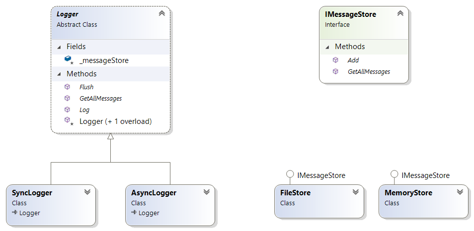

# Overview

In this kata you implement the Gang Of Four Bridge Pattern [[1](#ref-1), [2](#ref-2), [3](#ref-3)].

You task is to implement a logging system. To log messages, an application creates a `logger` instance. The `logger.Log` method takes a `string` message and stores it in a message store. A `logger.GetAllMessages` method retrieves all messages stored so far.

The goal is to allow the application to select one of different message stores and to select one of different approaches of sending the messages to the message store. The design shall allow for developing the message stores and the logging mechanisms independently from each other, e.g. by two different teams. Further details are given in the Requirements section below.

The following diagram shows the resulting bridge pattern:

## Requirements

To display all received messages at a later time the Logger ...

1. ... accepts a log message (string).
2. ... stores each log message to memory.
2. ... allows to display all messages stored so far.

To support persisting messages in different storage locations and formats,

4. ... the Logger allows to select persisting log messages in a file instead of in memory.

To facilitate decoupling of Log Message recording from Log Message storing, ...

5. ... another Logger variant shall send the log messages asynchronously to the storage. This means that the `Logger.Log` method returns immediately even while the message is still processed by the storing mechanism.

## Constraints and Hints

- Write unit tests verifying each requirement.
- For the asynchronous mechanism use a stub (mock) persistence mechanism which introduces a delay.
- Ensure that the synchronous mechanism does not return before the delay is reached.
- Ensure that the delay is longer than the minimum time required to execute the log without a delay configured for the stub.
- Ensure that the asynchronous mechanism returns right after the minimum time required to log a message even if a larger delay is configured.
- You may want to implement a mechanism which forces the asynchronous `Logger` to wait until all asynchronous operations have completed before checking whether all messages have been logged.

## Finishing Touches

- Ensure that the object persisting the log messages is declared and defined in the abstract parent class of the async and synchronous loggers.
- Avoid duplicated code (use `tools\dupfinder.bat`).
- Fix all static code analysis warnings.

## References

<a name="ref-1">[1]</a> David Starr and others: "Bridge Pattern" in "Pluralsight: Design Patterns Library", https://www.pluralsight.com/courses/patterns-library, last visited on Mar 11, 2020.

<a name="ref-2">[2]</a> Erich Gamma, Richard Helm, Ralph Johnson, John Vlissides: "Design Patterns: Elements of Reusable Object-Oriented Software", Addison Wesley, 1994, pp. 151ff, [ISBN 0-201-63361-2](https://en.wikipedia.org/wiki/Special:BookSources/0-201-63361-2).

<a name="ref-3">[3]</a> Wikipedia: "Bridge Pattern", https://en.wikipedia.org/wiki/Bridge_pattern, last visited on Mar. 11, 2020.
